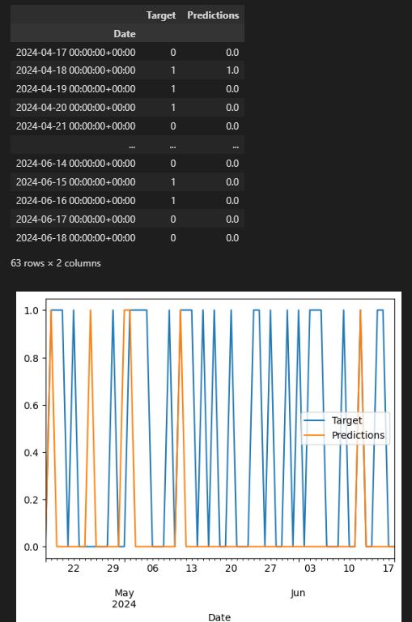

# Stock Predictor

A stock prediction machine learning model built using **scikit-learn** and a **RandomForestClassifier**, with data fetched from the **Yahoo Finance API**.

---

## 🔍 Features

- Rolling window backtesting for robust performance evaluation  
- Data preprocessing and cleanup using **pandas**  
- Trained using historical market data and technical indicators

---

## 🖼️ Demo

---
